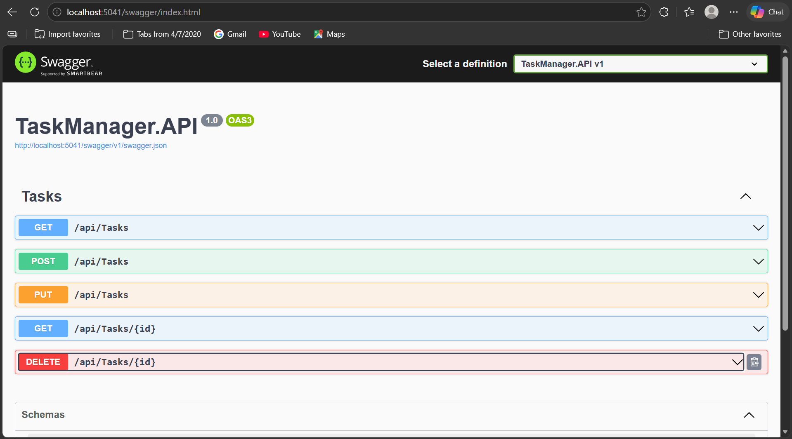

# Task Manager - Cloud Native .NET Application

## 🚀 Overview
This is a cloud-native Task Manager API built using .NET 8 with Clean Architecture principles.

## 🏗️ Architecture
- API Layer (Controllers)
- Application Layer (Business Logic)
- Domain Layer (Entities)
- Infrastructure Layer (Data Access)

## ⚙️ Tech Stack
- .NET 8 Web API
- Clean Architecture
- Dependency Injection
- Swagger (API Testing)

## 📌 Features
- Create Task
- Get All Tasks
- Get Task by ID
- Update Task
- Delete Task

## 🧪 Testing
API tested using Swagger UI

## 🔜 Upcoming Enhancements
- SQL Server Integration (EF Core)
- Dockerization
- CI/CD Pipeline
- Kubernetes Deployment

## 👨‍💻 Author
Namrata T.